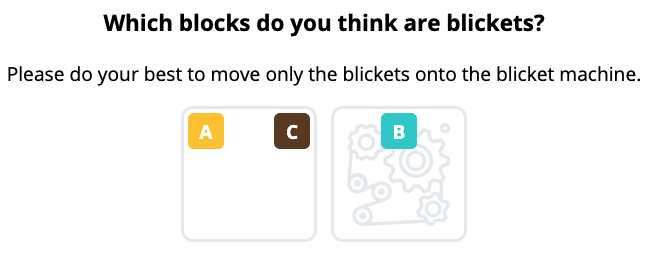

## Preliminaries
- Can everyone see the Teams chat?
- This meeting is recorded

---

# JSON Processing Tools!
#### ...on the Command Line
June 2021

---

# Why use JSON processing tools for online experiments?
<!--
focus is on why and what's possible with these tools, not how to use them
one possible way of manipulating JSON
-->

---

# 1. Online web applications send and store data as JSON
<!-- I'll use the blicket experiment as my running example because I'm very familiar with this experiment and therefore can use it to make a more compelling case about why JSON tools are useful -->



<div class="fragment">
<pre class="js"><code>{
  "blicket_answer_combo": {
    "bitstring": "010",
    "timestamp": 1610553268218
  }
}
</code><pre>
</div>

|||

# Demo: full JSON data

---

# 2. Extract simple answers _directly_ from the JSON data
fast and low effort <!-- .element: class="fragment" -->

<!-- compared to first transforming JSON to dataframes (R/Python) and then extracting answers  -->

<br>

#### Tool: [`fx`](https://github.com/antonmedv/fx)
<!-- .element: class="fragment" -->

|||

#### Demo: How many participants fell into bot traps?

<div class="fragment">
<pre class="js"><code>.filter(x => x.is_trouble)
</code><pre>
</div>

<br>

#### Demo: How many participants completed experimental condition X? <!-- .element: class="fragment" -->

<div class="fragment">
<pre class="js"><code>.filter(x => x.seq_key == "End" && x.condition_name == "d1_c3").length
</code><pre>
</div>

<br>

<!-- #### Demo: How much total bonus should I pay participants? <\!-- .element: class="fragment" -\-> -->

<!-- <div class="fragment"> -->
<!-- <pre class="js"><code>.map(x => x.total_bonus).filter(x => x != null).reduce((x,y) => x+y) -->
<!-- </code><pre> -->
<!-- </div> -->

---

# 3. Quick workflow for transforming JSON to Python/R dataframes
while minimizing nested looping in Python or R <!-- .element: class="fragment" -->

<br>

#### Tools: [`fx`](https://github.com/antonmedv/fx), [`jmespath`](https://github.com/jmespath/jmespath.py)
<!-- .element: class="fragment" -->

|||

## JSON
For each participant who _completed the experiment_, I want to put the highlighted lines into one dataframe.

<!-- index 50 -->
```json [|3|50]
{
  "experimentId": "active_blicket_comp_101-mturk",
  "sessionId": "HEK6SuiEtrkTgkE28vMfanYFg5WGvDWQ",
  "timestamp": 1610633390205,
  "route": "/conditions/2",
  "condition_name": "c1_d3",
  "passed_intro": true,
  "seq_key": "End",
  "is_trouble": false,
  "honeypot_responses": {
    "num_filled": 0,
    "christopher_robin": null,
    "piglet": null,
    "tigger_0": null,
    "tigger_1": null,
    "eeyore": null
  },
  "num_cont_clicks": 1,
  "quiz_data": {
    "level_1": {
      "activation_answer_groups": [
        false,
        false,
        false,
        false,
        false,
        false,
        true
      ],
      "correct_activation_answers": [
        false,
        false,
        false,
        true,
        false,
        false,
        true
      ],
      "score_ith_activation_answer": [
        true,
        true,
        true,
        true,
        true,
        true,
        true
      ],
      "activation_score": 6,
      "blicket_answer_combo": {
        "bitstring": "111",
        "timestamp": 1610633202413
      },
      "free_response_0": "IT has to be ABC and all three have to be there",
      "free_response_1": "I tried a variety of clicks but it placed them all the same everytime"
    },
    "level_3": {
      "activation_answer_groups": [
        true,
        true,
        true,
        true,
        true,
        true,
        true
      ],
      "correct_activation_answers": [
        true,
        true,
        true,
        true,
        false,
        false,
        true
      ],
      "score_ith_activation_answer": [
        true,
        true,
        true,
        true,
        true,
        true,
        true
      ],
      "activation_score": 5,
      "blicket_answer_combo": {
        "bitstring": "111111111",
        "timestamp": 1610633381335
      },
      "free_response_0": "It needs at least on block although some dont work with only one",
      "free_response_1": "I tried a variety of options including just one block, two blocks, three blocks, and all blocks"
    }
  },
  "score": 11,
  "max_score": 14,
  "bonus_per_q": 0.075,
  "total_bonus": 0.825,
  "feedback": "IT was interesting. I have nothing else to add. thanks!"
}
```


|||

## Demo: to filtered JSON via `fx`

<div class="fragment">
<pre class="bash"><code>fx '.filter(x => x.seq_key == "End" && !x.is_trouble).map(x => ({id: x.sessionId, combo: x.quiz_data.level_1.blicket_answer_combo.bitstring}))' > id_combo.json
</code><pre>
</div>

|||

## Demo: to Dataframe!

<!-- conda activate playground -->
Python  <!-- .element: class="fragment" -->

<div class="fragment">
<pre class="py"><code>import pandas as pd
df = pd.read_json("id_combo.json")
df
type(df)  # <class 'pandas.core.frame.DataFrame'>
</code><pre>
</div>

R  <!-- .element: class="fragment" -->

<div class="fragment">
<pre class="r"><code>library(jsonlite)
df <- fromJSON("id_combo.json")
head(df)
class(df)  # [1] "data.frame"
</code><pre>
</div>

|||

## Bonus demo: Full transformation in only Python via `jmespath`

```py
import json
import jmespath
import pandas as pd

with open('demo_data.json') as f:
    data_list = json.load(f)

filtered_list = jmespath.search("[?seq_key=='End' && !is_trouble].{id: sessionId, combo: quiz_data.level_1.blicket_answer_combo.bitstring}", data_list)

df = pd.DataFrame(filtered_list)
df
type(df)  # <class 'pandas.core.frame.DataFrame'>
```

---

# Learning JSON processing tools
[`fx`](https://github.com/antonmedv/fx): look up `javascript` array and object transformations 
<!-- .element: class="fragment" -->

[`jmespath`](https://github.com/jmespath/jmespath.py) (most mature in Python): the documented examples are really good 
<!-- .element: class="fragment" -->

<!-- Special mention: -->
<!-- - [`jq`](https://github.com/stedolan/jq) -->
<!--   - - syntax is awkward to learn -->
<!--   - + is mature  -->
<!--   - + has interfaces on the [command line](https://stedolan.github.io/jq/download/) and in Python ([jq.py](https://github.com/mwilliamson/jq.py), [pyjq](https://github.com/doloopwhile/pyjq)) and [R](https://github.com/ropensci/jqr) -->

Feel free to message me with questions! <!-- .element: class="fragment" -->

